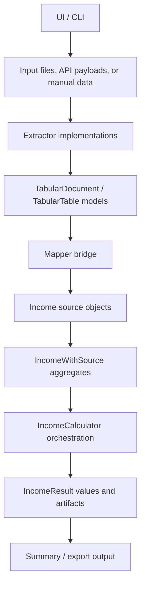

# Self Assessment Helper

A flexible, framework-agnostic Java helper for UK Self Assessment workflows. The current focus is preparing gross and adjusted income figures from multiple sources; taxable income and tax due calculations can be added as later extensions.

## Features

- Support for multiple income types:
  - **Rent-a-Room** income with expense tracking
  - **Dividend** income
  - **Savings** income (including foreign savings conversion support)

- Gross and adjusted income summaries by category
- Local income adjustments where the income source has enough context
- FX conversion support for foreign savings
- Detailed summaries for Self Assessment preparation

## Project Structure

```
.github/
└── workflows/
  └── maven.yml

scripts/
└── git-hooks/
  └── pre-commit

src/
├── main/
│   ├── java/com/helper/
│   │   ├── calculations/     # Calculation workflow orchestration
│   │   ├── config/           # Tax-year configuration
│   │   ├── income/           # Income contracts, builders, and implementations
│   │   ├── ingestion/        # Extractors, tabular source models, and mapper shells
│   │   └── support/          # Shared support services such as FX
│   └── resources/
│       └── tax/
│           └── tax-allowances.json
└── test/
  └── java/com/helper/
    ├── calculations/
    └── income/

pom.xml
setup.sh
```

## Calculation Architecture

The helper is intended to keep UI, ingestion, domain mapping, and tax calculations separate. A UI or CLI should collect user choices and files, call the relevant ingestion components, then pass normalized income objects into the calculation workflow.



Current implementation covers these layers:

- **DataSource** identifies supported sources such as HSBC, Cahoot, Citi, IBKR, JPMPI, and HMRC.
- **Extractors** read source-specific data into tabular source documents. Current extractor shells include bank statements, IBKR trades, and JPMPI tax statements.
- **TabularDocument / TabularTable** represent source-shaped data before it is mapped into calculation domain objects.
- **Mapper** is the named bridge from extracted tables to domain objects. Current mapper shells cover HSBC, Cahoot, and Citi savings mappings.
- **IncomeWithSource** income objects accept source objects directly.
- **Income objects** such as `SavingIncome`, `DividendIncome`, `CapitalGainIncome`, and `RentARoomIncome` produce `IncomeResult` values from `calculateResult()`.
- **IncomeResult** carries gross income, adjusted income, and calculation artifacts.
- **IncomeCalculator** is currently a shell for calculation workflow orchestration.

The mapper bridge is not implemented yet. When added, it should translate extracted tables into income source objects before those sources are added to `IncomeWithSource` aggregates. The UI should not know calculation details; it should choose sources, trigger extraction/mapping, and hand the assembled income objects to the calculator.

Simple income categories may be able to feed table rows into an income source object incrementally. For example, savings interest rows could add monthly income into a `Saving` source before that source is added to the aggregate `SavingIncome`.

More complex categories can combine multiple source inputs inside the income source object. For example, a non-UK domiciled accumulating dividend source can take broker holding data and an `AccumulatingFundReport`, determine units held on the fund report date, and calculate the resulting dividend amount.

Local adjustments live in the income class when the source has enough context. For example, `RentARoomIncome` can choose between the Rent-a-Room allowance and actual expenses. Most income types use the default adjusted income, which is the same as gross income.

## Income Models

The core income contract is `Income` (`com.helper.income.Income`).

Current concrete/related income models include:

- `IncomeCalculator` (`com.helper.calculations`) - shell for calculation workflow orchestration
- `RentARoomIncome` (`com.helper.income.implementation`) - Rent-a-Room income with allowance vs actual-expense adjusted-income comparison
- `SavingIncome` (`com.helper.income.implementation`) - aggregate savings category income
- `ForeignSaving` (`com.helper.income.implementation.savings`) - foreign savings input with monthly/yearly FX conversion support
- `Saving` (`com.helper.income.implementation.savings`) - contract for savings contributors used by `SavingIncome`
- `Dividend` (`com.helper.income.implementation.dividend`) - contract for dividend contributors

## Usage

TODO: Add up-to-date usage examples after API stabilization.

## Local Configuration

Secrets and account-specific settings should live in local config files that are not committed.

For IBKR Flex Web Service access:

```bash
cp config/ibkr-flex.example.properties config/ibkr-flex.properties
```

Then edit `config/ibkr-flex.properties`:

```properties
ibkr.flex.token=your-flex-web-service-token
ibkr.flex.query-id=your-saved-flex-query-id
ibkr.flex.version=3
```

`ibkr.flex.token` is secret and must not be committed. `ibkr.flex.query-id` is the ID of the saved Flex Query you created in IBKR Client Portal.

The saved IBKR Flex Query should be an XML Activity Flex Query with the `Trades` section enabled. The current IBKR trade table parser expects fields such as `accountId`, `assetCategory`, `symbol`, `description`, `conid`, `tradeDate`, `settleDateTarget`, `buySell`, `quantity`, `tradePrice`, `proceeds`, `ibCommission`, `currency`, and `fifoPnlRealized`.

Tax-year date ranges should be computed by code from `TaxYear` and sent to IBKR as Flex Web Service request parameters:

```text
fd=yyyyMMdd
td=yyyyMMdd
```

Do not store tax-year dates in the local properties file.

## Building

```bash
mvn clean install
```

## Running Tests

```bash
mvn test
```

## Future Enhancements

- [ ] Capital gains income summaries
- [ ] Self-employment income and NI
- [ ] Marriage Allowance calculations
- [ ] Child benefit tax charges
- [ ] Student Loans repayment tracking
- [ ] Export to Self Assessment helper formats (CSV, JSON)
- [ ] Web UI integration
- [ ] CLI tool wrapper
- [ ] Taxable income calculator by category
- [ ] Tax due estimate summaries
